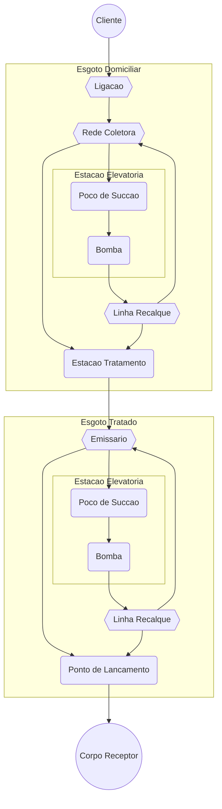

# Sewer Data Management (pt_BR)

Modelo de dados geoespaciais para sistemas de esgotamento sanitario.

### Fluxograma

Fluxo simplificado do esgoto, desde a ligacao na rede coletora ate o lancamento no efluente.

### Modelo de dados conceitual

...

### Modelo de dados lógico

```mermaid
erDiagram
	redes_esgoto }o--|| tipo_rede_esgoto : references
	redes_esgoto }o--|| tipo_esgoto : references
	redes_esgoto }o--|| tipo_material : references
	redes_esgoto }o--|| tipo_situacao : references
	estacoes_tratamento }o--|| tipo_nivel_tratamento_esgoto : references
	estacoes_tratamento }o--|| tipo_situacao : references
	estacoes_elevatorias }o--|| tipo_esgoto : references
	estacoes_elevatorias }o--|| tipo_situacao : references
	bombas }o--|| estacoes_elevatorias : references
	bombas }o--|| tipo_bomba : references
	bombas }o--|| tipo_situacao : references
	pocos_succao }o--|| estacoes_elevatorias : references
	pocos_succao }o--|| tipo_forma : references
	pocos_succao }o--|| tipo_material : references
	lancamentos_efluente }o--|| tipo_lancamento : references
	lancamentos_efluente }o--|| tipo_esgoto : references
	lancamentos_efluente }o--|| tipo_manancial : references
	valvulas }o--|| tipo_valvula : references
	valvulas }o--|| tipo_funcao_valvula : references
	valvulas }o--|| tipo_acionamento_valvula : references
	valvulas }o--|| tipo_acesso_valvula : references
	valvulas }o--|| tipo_posicao_valvula : references
	valvulas }o--|| tipo_situacao : references
	unidades_inspecao }o--|| tipo_unidade_inspecao : references
	unidades_inspecao }o--|| tipo_forma : references
	unidades_inspecao }o--|| tipo_material : references
	unidades_inspecao }o--|| tipo_forma : references
	unidades_inspecao }o--|| tipo_material : references
	conexoes }o--|| tipo_conexao : references
	conexoes }o--|| tipo_material : references

	tipo_rede_esgoto {
		SMALLINT id
		VARCHAR tipo
	}

	tipo_esgoto {
		SMALLINT id
		VARCHAR tipo
	}

	tipo_material {
		SMALLINT id
		VARCHAR tipo
	}

	tipo_situacao {
		SMALLINT id
		VARCHAR tipo
	}

	redes_esgoto {
		SERIAL id
		BLOB geom
		SMALLINT tipo
		SMALLINT esgoto
		SMALLINT material
		SMALLINT diametro
		NUMERIC(6) cota_montante
		NUMERIC(3) profundidade_montante
		NUMERIC(6) cota_jusante
		NUMERIC(3) profundidade_jusante
		NUMERIC(7) declividade
		SMALLINT situacao
		VARCHAR(255) localizacao
		VARCHAR(255) observacoes
	}

	setores_esgotamento {
		SERIAL id
		BLOB geom
		VARCHAR(255) observacoes
	}

	tipo_nivel_tratamento_esgoto {
		SMALLINT id
		VARCHAR tipo
	}

	tipo_tecnologia_tratamento_esgoto {
		SMALLINT id
		VARCHAR tipo
	}

	estacoes_tratamento {
		SERIAL id
		BLOB geom
		VARCHAR(50) nome
		SMALLINT nivel_tratamento
		SMALLINT tecnologia
		NUMERIC(6) vazao
		SMALLINT situacao
		VARCHAR(255) localizacao
		VARCHAR(255) observacoes
	}

	estacoes_elevatorias {
		SERIAL id
		BLOB geom
		VARCHAR(50) nome
		SMALLINT esgoto
		SMALLINT situacao
		VARCHAR(255) localizacao
		VARCHAR(255) observacoes
	}

	tipo_bomba {
		SMALLINT id
		VARCHAR tipo
	}

	bombas {
		SERIAL id
		BLOB geom
		INTEGER id_estacao_elevatoria
		SMALLINT tipo
		SMALLINT diametro_entrada
		SMALLINT diametro_saida
		NUMERIC(6) vazao
		NUMERIC(6) potencia
		NUMERIC(4) pressao
		SMALLINT situacao
		VARCHAR(255) localizacao
		VARCHAR(255) observacoes
	}

	tipo_forma {
		SMALLINT id
		VARCHAR tipo
	}

	pocos_succao {
		SERIAL id
		BLOB geom
		SMALLINT id_estacao_elevatoria
		NUMERIC(6) cota_nivel
		NUMERIC(6) cota_fundo
		NUMERIC(3) profundidade
		SMALLINT diametro
		INTEGER volume
		NUMERIC(3) nivel_min
		NUMERIC(3) nivel_max
		SMALLINT forma_tampao
		SMALLINT material_tampao
		SMALLINT diametro_tampao
		VARCHAR(255) localizacao
		VARCHAR(255) observacoes
	}

	tipo_lancamento {
		SMALLINT id
		VARCHAR tipo
	}

	tipo_manancial {
		SMALLINT id
		VARCHAR tipo
	}

	lancamentos_efluente {
		SERIAL id
		BLOB geom
		SMALLINT tipo
		SMALLINT local_lancamento
		SMALLINT esgoto
		SMALLINT tipo_corpo_receptor
		VARCHAR nome_corpo_receptor
		VARCHAR(255) localizacao
		VARCHAR(255) observacoes
	}

	tipo_valvula {
		SMALLINT id
		VARCHAR tipo
	}

	tipo_funcao_valvula {
		SMALLINT id
		VARCHAR tipo
	}

	tipo_acionamento_valvula {
		SMALLINT id
		VARCHAR tipo
	}

	tipo_acesso_valvula {
		SMALLINT id
		VARCHAR tipo
	}

	tipo_posicao_valvula {
		SMALLINT id
		VARCHAR tipo
	}

	valvulas {
		SERIAL id
		BLOB geom
		SMALLINT tipo
		SMALLINT funcao
		SMALLINT diametro
		SMALLINT acionamento
		SMALLINT acesso
		NUMERIC(3) profundidade
		SMALLINT posicao
		NUMERIC(3) qtd_voltas_fechar
		SMALLINT situacao
		VARCHAR(255) localizacao
		VARCHAR(255) observacoes
		NUMERIC rotacao_simbolo
	}

	tipo_unidade_inspecao {
		SMALLINT id
		VARCHAR tipo
	}

	unidades_inspecao {
		SERIAL id
		BLOB geom
		SMALLINT tipo
		SMALLINT forma
		SMALLINT material
		SMALLINT diametro
		NUMERIC(6) cota_nivel
		NUMERIC(6) cota_fundo
		NUMERIC(3) profundidade
		SMALLINT forma_tampao
		SMALLINT material_tampao
		SMALLINT diametro_tampao
		BOOLEAN extravasor
		NUMERIC(6) cota_extravasor
		NUMERIC(3) profundidade_extravasor
		VARCHAR(255) localizacao
		VARCHAR(255) observacoes
	}

	tipo_conexao {
		SMALLINT id
		VARCHAR tipo
	}

	conexoes {
		SERIAL id
		BLOB geom
		SMALLINT tipo
		SMALLINT material
		SMALLINT diametro_entrada
		SMALLINT diametro_saida
		NUMERIC(3) profundidade
		VARCHAR(255) localizacao
		VARCHAR(255) observacoes
		NUMERIC rotacao_simbolo
	}
```

### Modelo de dados físico

...
