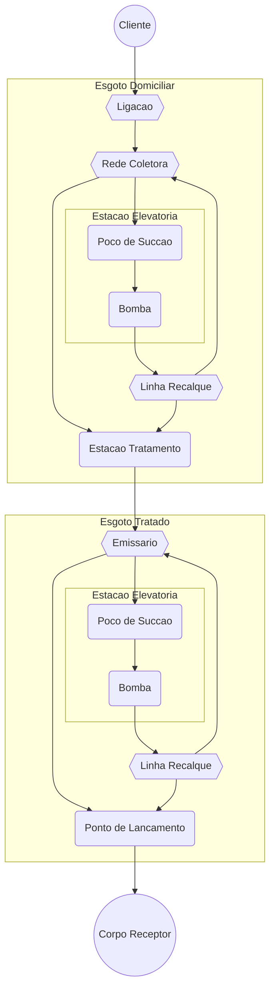

# Modelo de dados para Sistemas de Esgoto

Modelo de dados espaciais para sistemas de esgotamento sanitario.

## Itens

- Ligacao de esgoto
  - Tubulacao
    - Ramal
  - Unidade de Inspecao
    - Caixa de Passagem
    - Terminal de Inspecao e Limpeza
  - Conexoes
    - Curva
    - Selim
- Rede Coletora
  - Tubulacao
    - Coletor
    - Coletor Tronco
    - Interceptor
  - Unidade de Inspecao
    - Caixa de Passagem
    - Poco de Inspecao
    - Poco de Visita
    - Terminal de Limpeza
- Estação Elevatória de Esgoto Sanitário: Instalação que se destina ao transporte do esgoto do nível do poço de sucção das bombas ao nível de descarga na saída do recalque, acompanhando aproximadamente as variações da vazão afluente
  - Bomba Centrifuga: São caracterizadas por possuírem um elementorotativo dotado de pá(rotor), que fornece aoliquido o trbalho mecânico para vencer o desnível. Composta em geral por quatro partes essenciais, são elas: carcaça, rotor ou punsionador, o eixo, a vedação e mancal.
  - Poço de Sucção: Estrutura de transição que recebe as contribuições dos esgotos afluentes e as coloca à disposição das unidades de recalque.
  - Tubulacao
    - Linha de Recalque (LR): Tubulação de saída da EEE, tendo inicio após a última interligação do barrilete, opera em regime forçado
  - Conexao
    - Te
    - Curva
    - Ventosa
  - Valvula
    - Válvulas Gaveta: São utilizadas para isolar as linhas de suçcão e de recalque, nas ocasiões de manutenção das tubulações e equipamentos eletro-mecanicos da elevatória. Permitem boa vedação mesmo em altas pressoese, quando completamente abertas, oderecem pouca resistência à passagem do líquido.
    - Vávulas de Retenção: Permitem apenas o escoamento do fluxo em uma direção e destinam-se à proteção das instalações de recalque contra o fluxo liquido.
    - Válvulas Borboleta: Utilizadas para grandes diâmetros, as válvulas borboletas geralmente são mais econômicas do que as válvulas gaveta e requerem espaço menor instalação. Ocorre que sua vedação não é eficaz quanto válvula gaveta, especialmente em altas pressões.
    - Vávula Flap: Utlizada em extrvasores por gravidade das elevatórias, a fim de evitar o refluxo da água nas ocasiões do nível máximo do corpo receptor, tendo o funcionamento semelhante ao da válvula de retenção.
- Estacao Tratamento
  - Tubulacao
    - Emissario
  - Unidades de Inspecao
- Corpo Receptor
  - Hidrografia
  - Sistema de drenagem de aguas pluviais

### Fluxograma

```mermaid
flowchart TB
    inicio((Cliente))
    t1{{"Ligacao"}}
    t2{{"Rede Coletora"}}
    ps("Poco de Succao")
    b1("Bomba")
    t4{{"Linha Recalque"}}
    ete("Estacao Tratamento")
    t5{{"Emissario"}}
    ps2("Poco de Succao")
    b2("Bomba")
    t6{{"Linha Recalque"}}
    fim(("Corpo Receptor"))
    pl("Ponto de Lancamento")

    inicio --> t1
    subgraph "Esgoto Domiciliar"
        t1 --> t2
        t2 --> ps
        subgraph Estacao Elevatoria
            ps --> b1
        end
        b1 --> t4
        t4 --> t2
        t2 --> ete
        t4 --> ete
    end
    subgraph "Esgoto Tratado"
        ete --> t5
        t5 --> ps2
        subgraph "Estacao Elevatoria"
            ps2 --> b2
        end
        b2 --> t6
        t6 --> t5
        t5 --> pl
        t6 --> pl
    end
    pl --> fim
```
