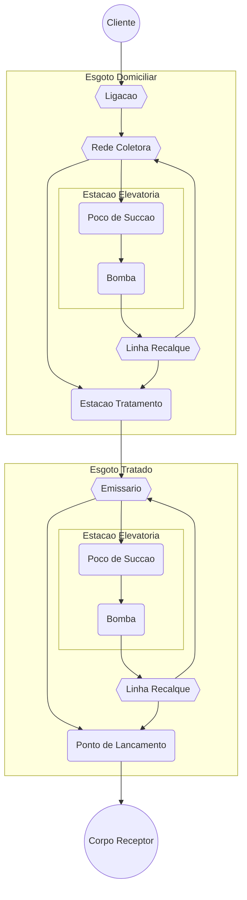

### Fluxograma

Fluxo simplificado desde a ligacao na rede coletora ate o lancamento do efluente.

```mermaid
flowchart TB
    inicio((Cliente))
    t1{{"Ligacao"}}
    t2{{"Rede Coletora"}}
    ps("Poco de Succao")
    b1("Bomba")
    t4{{"Linha Recalque"}}
    ete("Estacao Tratamento")
    t5{{"Emissario"}}
    ps2("Poco de Succao")
    b2("Bomba")
    t6{{"Linha Recalque"}}
    fim(("Corpo Receptor"))
    pl("Ponto de Lancamento")

    inicio --> t1
    subgraph "Esgoto Domiciliar"
        t1 --> t2
        t2 --> ps
        subgraph Estacao Elevatoria
            ps --> b1
        end
        b1 --> t4
        t4 --> t2
        t2 --> ete
        t4 --> ete
    end
    subgraph "Esgoto Tratado"
        ete --> t5
        t5 --> ps2
        subgraph "Estacao Elevatoria"
            ps2 --> b2
        end
        b2 --> t6
        t6 --> t5
        t5 --> pl
        t6 --> pl
    end
    pl --> fim
```
